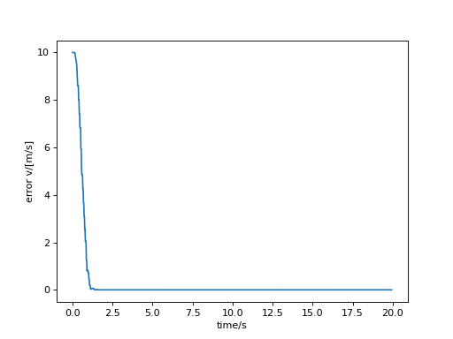
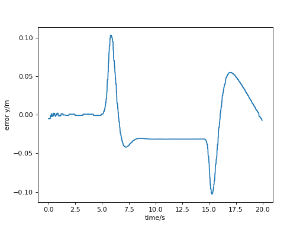
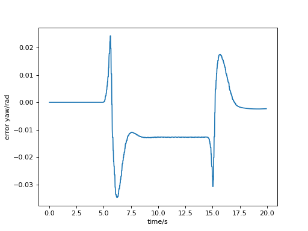
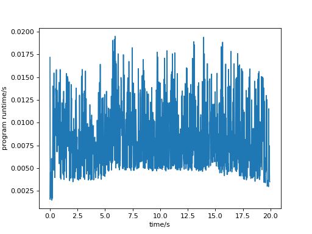

# pid_lon_mpc_lat
Controller for trajectory tracking.
using PID to track speed and using LTV-MPC to track path.

### Dependencies
1. Install osqp-eigen(this repository is done it for you. If  you get an error about osqp-eigen when compiling, try to reinstall:
   https://robotology.github.io/osqp-eigen/
   https://zhuanlan.zhihu.com/p/630722681?eqid=be16ef920012778a0000000464915511
   if you don't have osqp and Eigen3, you need to install them.

### How to Run
1. Build everything with ```catkin_make```  from the root directory of your catkin workspace.
2. Use ```roscore``` to start ros.
3. Use ```rviz``` to start rviz.
4. Open vehicle_simulator.rviz in rviz.
5. Open the root directory of the catkin worksapce, don't forget to ```source ./devel/setup.bash```.
6. Launch the simulator by entering the command below in terminal :
    roslaunch pid_lon_mpc_lat start_simulator.launch
7. Launch the controller by entering the command below in terminal:
    roslaunch pid_lon_mpc_lat start_controller.launch
8.  After the program finishes running, you can use deal_work.py to process the data.

### Results
1. U-turn error v
    
2. U-turn error y
   
3. U-turn error yaw
   
4. U-turn program runtime
   
   

   

   

